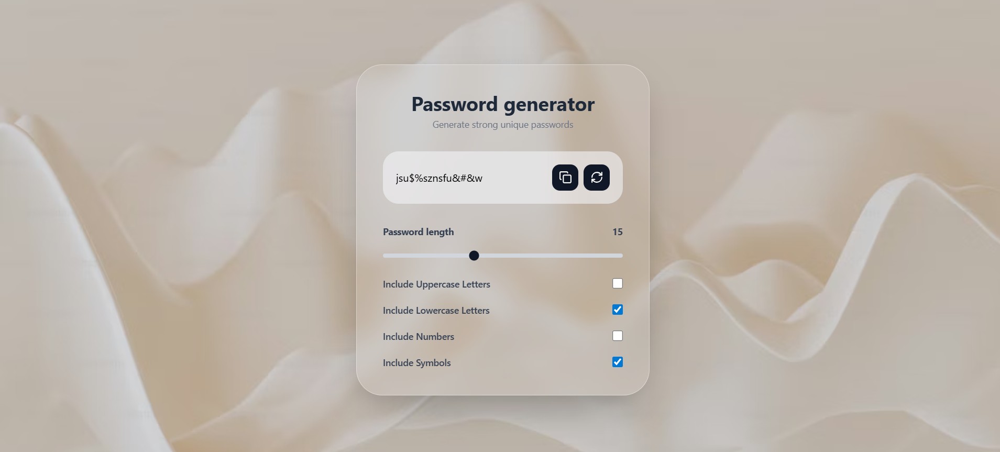

🛡️ Glassmorphism Password Generator
A sleek, modern password generator built with React and Tailwind CSS. This tool allows users to generate secure, customizable passwords with a single click, featuring a high-end glassmorphism UI inspired by modern design trends.

🖼️ Project Preview

🧠 Learning Journey: Growth Through Building
Building this project was about more than just generating random strings; it was a deep dive into the React ecosystem and modern CSS techniques.

Key Takeaways:
Mastering React Hooks: This project solidified my understanding of useCallback for memoizing functions and useEffect for synchronizing state with the UI.

The Power of useRef: I learned how to move beyond standard props to interact directly with DOM elements, specifically for text selection and clipboard APIs.

Designing with Constraints: Implementing "Glassmorphism" taught me how to balance transparency, backdrop-blur, and borders to create depth without sacrificing readability.

State-Driven Logic: Managing five different state variables (length, character types, etc.) taught me how to structure a clean, reactive data flow.

🛠️ Tech Stack
Frontend Library: React.js

Styling: Tailwind CSS

Icons: Heroicons / SVG

Hooks: useState, useEffect, useRef, useCallback

⚡ Technical Highlights
Logic & Performance
To ensure the app remains fast even as settings change, the generation logic is wrapped in a useCallback and triggered by a useEffect dependency array. This ensures the password stays in sync with user preferences without unnecessary re-renders.

Clipboard Integration
I implemented the Clipboard API with a fallback selection range to ensure the "Copy" functionality works seamlessly across both desktop and mobile browsers.

